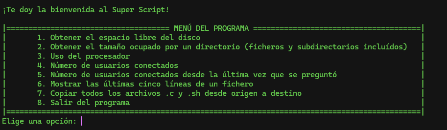

# Bash Script

A bash program for a college exercise. Skills practised:

* Bash scripting
* Set Variables
* Creating functions
* Piping commands
* For and while loops
* Looping over arrays
* Case expresions
* Regular expressions

## How to run it

Place yourself in the repo directory and just type ./script.sh in your terminal.

## Image

